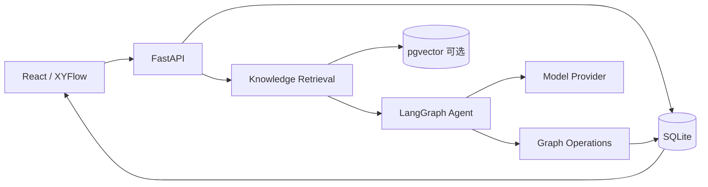
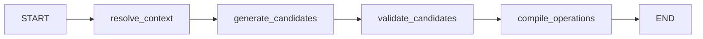

# NodeCanvas Agent 架构

本文描述当前仓库中已经落地的 Agent、模型注册表和执行边界。产品画布与 Agent 执行图是两个不同概念：XYFlow 图由用户编辑，LangGraph 图由后端执行，二者不能混成同一份状态。

## 1. 总体结构



主要代码：

```text
Agent/nodecanvas_agent/
├── models.py          # Pydantic 请求、上下文、候选和图操作模型
├── context_graph.py   # 产品画布上下文解析
├── provider.py        # OpenAI-compatible、本地与百炼生图 Provider
└── workflow.py        # LangGraph StateGraph

Backend/nodecanvas_backend/
├── main.py            # FastAPI 路由
├── repository.py      # SQLite 持久化、分块与关键词检索
├── vector_store.py    # 可选 pgvector 索引与语义检索
├── graph_ops.py       # Agent 操作写入产品画布
└── model_testing.py   # 模型连通性测试
```

## 2. LangGraph 执行图

当前使用 LangGraph Graph API 的 `StateGraph`：



状态字段：

```text
request        AgentRunRequest
knowledge      项目知识检索结果
context        ContextSnapshot
candidates     结构化候选
operations     create_node / update_node
provider_name  实际使用的 Provider
```

知识检索先按项目过滤文档，再根据配置选择 SQLite 关键词检索或 pgvector 语义检索；检索结果会保留来源文档和分块信息，供 Agent 生成上下文与前端 Run 记录展示。

每个节点只返回自己的状态增量，不直接修改共享状态。图在 `AgentWorkflow` 初始化时编译，API 调用时通过 `graph.invoke()` 执行。

暂时未启用 Checkpointer。SQLite 已保存 Run 和 Context Snapshot，但 LangGraph 的中间 super-step 还没有持久化。加入人工审批、暂停恢复或长时间媒体任务时，应引入 PostgreSQL Checkpointer，并为每次 Run 使用稳定的 `thread_id`。

## 3. Context Graph 边界

当前产品约束：

- 节点只通过 `right-source → left-target` 建立业务关系。
- Agent 只读取左侧直接入边，不读取整个连通分量。
- 普通生成只在 Agent 右侧创建第一层结果。
- “修改、改写、更新”等请求只允许修改右侧直接出边目标。
- `@节点名` 可以明确指定一个直接出边目标。
- 备注节点不进入模型上下文。

这样可以避免无关分支污染 Prompt，也让一次 Agent 执行的影响范围可预测。

## 4. 模型 Provider

### DeterministicProvider

没有配置 API Key 时使用。它用于本地开发、自动化测试和 UI 联调，生成稳定的结构化候选，不冒充真实模型能力。

### OpenAICompatibleProvider

用于聊天、推理、结构化输出和视觉理解模型。请求发送到：

```text
{baseUrl}/chat/completions
```

当模型包含 `vision` 能力时，直接入边中的图片 URL 会以多模态 `image_url` 内容传入。

### DashScopeImageProvider

用于百炼同步生图接口。它接收 Agent 目标，按最多 4 张一批请求模型，再把返回的图片 URL 编译为图片节点。图片 URL 可能具有有效期，生产环境需要立即下载并转存对象存储。

## 5. 浏览器模型注册表

点击顶部 token counter 打开模型管理器。配置保存在：

```text
localStorage["nodecanvas:model-registry:v1"]
```

系统默认模型不可删除，但可以补充或修改 Base URL、API Key 和能力标签。自定义模型支持新增、编辑、删除和保存前测试。

默认模型：

| 模型 | 默认用途 | 协议 |
| --- | --- | --- |
| DeepSeek V4 Pro | 文本、思考、结构化输出 | OpenAI Chat |
| Qwen 3.7 Plus | 文本、思考、识图、长上下文 | OpenAI Chat |
| Qwen VL OCR | 识图、OCR、结构化提取 | OpenAI Chat |
| Wan 2.7 Image Pro | 生图与图片编辑 | 百炼生图 |

模型标识与能力参考官方资料：

- LangGraph: <https://docs.langchain.com/oss/python/langgraph/overview>
- DeepSeek API: <https://api-docs.deepseek.com/updates/>
- Qwen 视觉理解: <https://help.aliyun.com/zh/model-studio/vision-model/>
- Wan 2.7 生图: <https://help.aliyun.com/en/model-studio/wan-image-generation-and-editing-api-reference>

## 6. 模型测试

前端调用：

```text
POST /api/models/test
```

测试配置只存在于当前 HTTP 请求，后端不创建模型表，也不把 API Key 写入 SQLite。

- OpenAI Chat：发送一个 `max_tokens=8` 的最小请求并检查 Chat Completions 响应。
- 百炼生图：真实生成一张测试图片，因此可能产生少量费用；界面会提前提示。

当前没有登录系统，浏览器本地保存符合本地单用户阶段的需求，但任何能访问该浏览器配置或执行同源脚本的人都可能读取 API Key。进入多人或线上部署前，必须把凭据迁移到服务端加密存储或 Secret Manager。

## 7. 一次执行的完整过程

```text
1. 前端读取选中的模型配置和宫格大小
2. 请求 FastAPI /agent/runs
3. 后端检索项目知识片段
4. LangGraph 解析 Agent 直接入边
5. Provider 生成 rows × columns 个候选（知识片段作为受限上下文）
6. 校验数量、结构和重复内容
7. 编译 create_node / update_node 操作
8. 后端写入画布快照、Run 和 Context Snapshot
9. 前端使用后端图快照刷新 XYFlow
```

## 8. 后续演进顺序

1. revision 乐观锁，解决多标签页和长任务覆盖。
2. LangGraph Checkpointer 与稳定 `thread_id`。
3. SSE 按完整候选或图片任务状态推送。
4. 图片结果转存 MinIO/S3，避免供应商临时 URL 失效。
5. PostgreSQL + pgvector 混合检索、metadata filter 与可观测性。
6. 用户、工作区、权限和服务端凭据管理。
